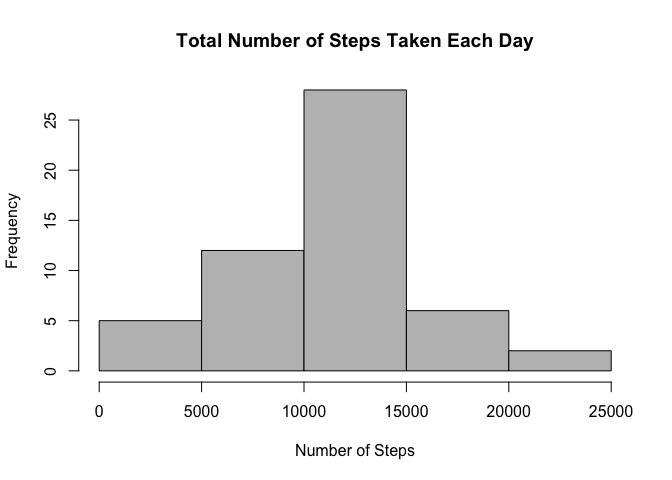
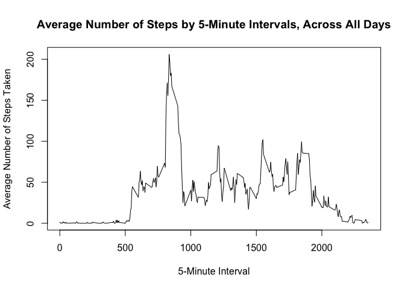
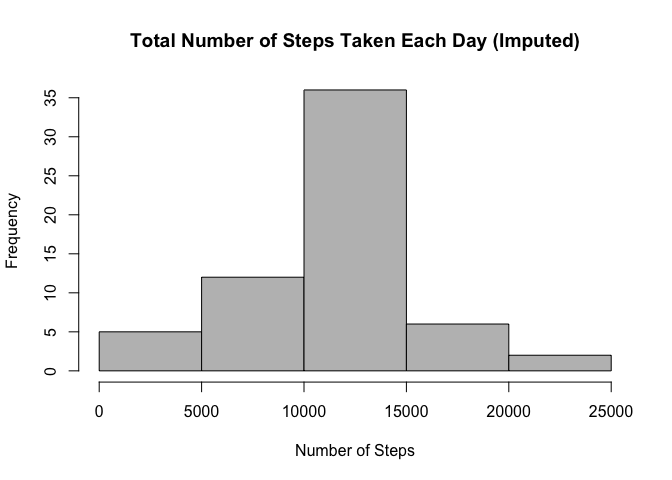
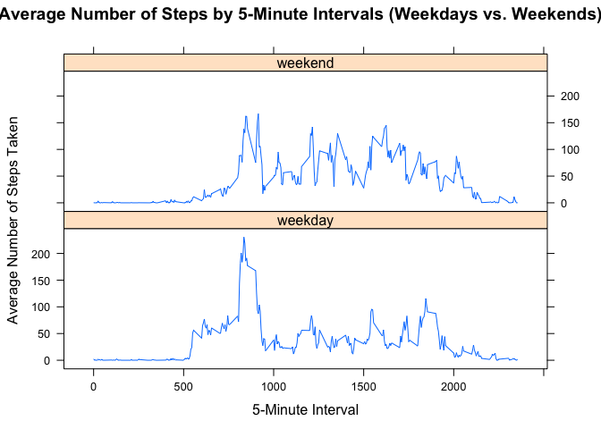

# Reproducible Research: Peer Assessment 1


## Loading and preprocessing the data
Load and preprocess the data. Remove rows with NAs.

```r
#assume activity.csv to exist in the current directory
act <- read.csv("activity.csv")
act <- transform(act, date = as.Date(date, "%Y-%m-%d"))
actNoNa <- na.omit(act)
```


## What is mean total number of steps taken per day?
First, let's look at a histogram of the total number of steps taken each day. For now, we are ignoring missing values in the data set.

```r
totStepsByDay <- aggregate(steps ~ date, actNoNa, sum)
hist(totStepsByDay$steps, col="grey",
     xlab="Number of Steps",
     main="Total Number of Steps Taken Each Day")
```

<!-- -->

```r
totStepsMean <- mean(totStepsByDay$steps)
totStepsMedian <- median(totStepsByDay$steps)
```

The mean total number of steps taken per day is **10766**, and the median is **10765**.


## What is the average daily activity pattern?
Next, lets make a time series plot of the 5-minute interval and the average number of steps taken, averaged across all days.

```r
avgStepsByInt <- aggregate(steps ~ interval, act, mean)
plot(avgStepsByInt$interval, avgStepsByInt$steps, type = "l",
     xlab="5-Minute Interval", ylab = "Average Number of Steps Taken",
     main="Average Number of Steps by 5-Minute Intervals, Across All Days")
```

<!-- -->

```r
maxIndex <- which.max(avgStepsByInt$steps)
maxAvgSteps <- avgStepsByInt$steps[maxIndex]
maxAvgInt <- avgStepsByInt$interval[maxIndex]
```

On average across all the days, the 5-minute interval **835**, contains the maximum number of steps - **`206.1698113`**


## Imputing missing values
There are a number of days/intervals where there are missing values. The presence of missing days may introduce bias into some calculations or summaries of the data.

The total number of missing values in the dataset is **`2304`**. Let's devise a strategy for filling in all of the missing values in the dataset. For each NA for the steps value in the activity dataset, we shall fill in the mean value for that time interval. We will do this on a copy of the dataset.


```r
#make a copy of the activity dataset
actImpute <- act

#for each NA for number of steps in the dataset 
for(i in which(is.na(actImpute$steps))) {
    #get the 5-minute interval that it corresponds to
    int <- actImpute$interval[i]
    #get the mean value for that 5-minute interval
    avgStepsForInt <- avgStepsByInt[which(avgStepsByInt$interval == int), ]$steps
    #replace the NA with the mean value
    actImpute$steps[i] <- avgStepsForInt
}
```

Let's look at a histogram of the total number of steps taken each day again, but now with the imputed dataset.

```r
totStepsByDayImpute <- aggregate(steps ~ date, actImpute, sum)
hist(totStepsByDayImpute$steps, col="grey",
     xlab="Number of Steps",
     main="Total Number of Steps Taken Each Day (Imputed)")
```

<!-- -->

```r
totStepsMeanImpute <- mean(totStepsByDayImpute$steps)
totStepsMedianImpute <- median(totStepsByDayImpute$steps)
```

After imputing the missing values, the mean total number of steps taken per day is **10766**, and the median is **10766**. It can be seen that the median has moved closer to the mean.


## Are there differences in activity patterns between weekdays and weekends?
We will use the dataset with the filled-in missing values for this part. First, lets create a new factor variable that indicates whether a given date is a weekday or weekend day.

```r
#add a column dayType, which indicates whether it's a weekday or weekend
actImpute <- transform(actImpute, dayType = ifelse(weekdays(actImpute$date) %in% c("Saturday", "Sunday"), "weekend", "weekday"))
#make it a factor
actImpute <- transform(actImpute, dayType = factor(dayType))
```

Next, let's make a panel plot containing a time series plot of the 5-minute interval and the average number of steps taken, averaged across all weekday days or weekend days.

```r
totStepsByIntDayTypeImpute <- aggregate(steps ~ interval + dayType, actImpute, mean)

library(lattice)
xyplot(steps ~ interval|dayType, data = totStepsByIntDayTypeImpute,
       type = "l", layout = c(1,2),
       xlab="5-Minute Interval", ylab = "Average Number of Steps Taken",
       main="Average Number of Steps by 5-Minute Intervals (Weekdays vs. Weekends)")
```

<!-- -->
